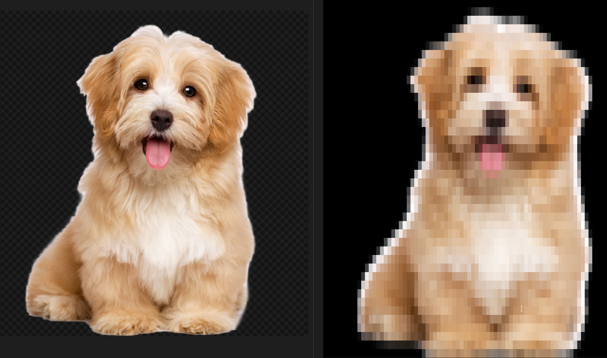

# Imager

Python script that renders images as text to the terminal either as ASCII art or as a colour image (on supported terminals) using ANSI colour escape codes. Uses PIL for image manipulation. Requires NumPy (external installation required).

Supports GIF, PDF, PNG, TIFF, and WebP image types.

# Examples 
`
imager images/cat.jpg  
`

`
imager images/dog.png -c  
`

## Installation
Requires a working installation of python3.

Use the package manager pip to install NumPy:  
`pip install numpy`  

Clone this repository:  
`git clone [this repository]`  

Run the script:  
`python3 imager.py filename`  

Or as an executable:  
`./imager.py filename`  

## Usage
`imager.py [-h] [-v] [-c] filename`  
 
### Flags:  
**Colour** `-c`: Outputs a colour image to the terminal. If omitted, script outputs an ASCII representation of the image. 

**Verbose** `-v`: Outputs statistics about the original and generated images including original and new resolution, aspect ratio and the downscale factor. 

## License
[MIT](https://choosealicense.com/licenses/mit/)

Feel free to use this however you wish.

